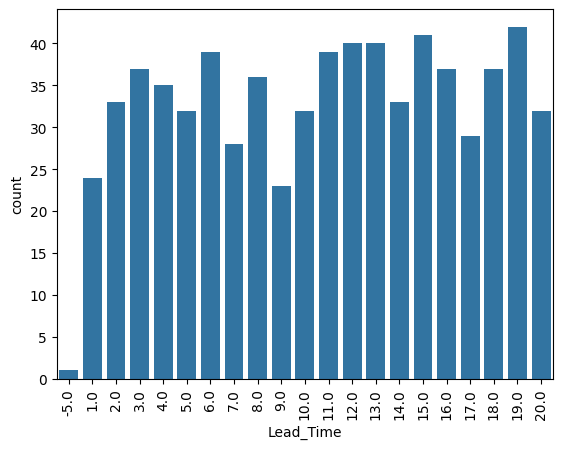
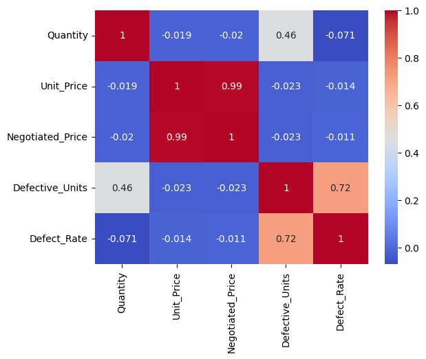
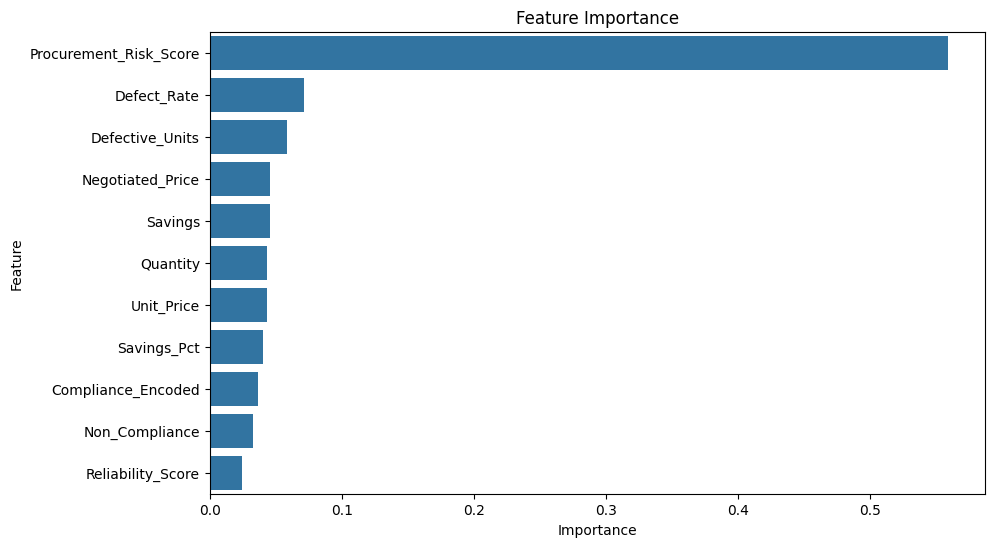
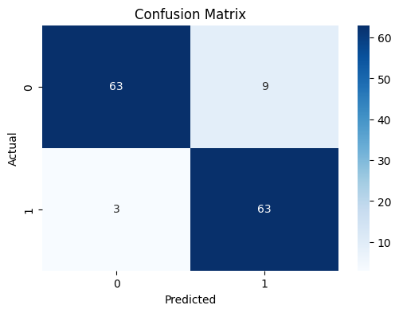
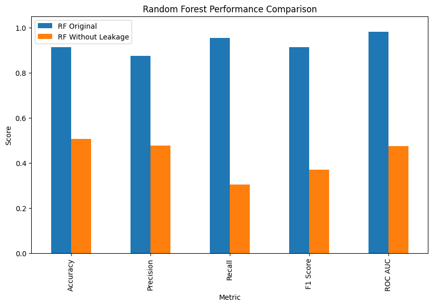

# Predicting Purchase Order Delays: A Procurement Analytics Case Study

In procurement operations, delivery delays can have a significant impact on inventory availability, production schedules, supplier performance, and operational costs.

In this project, I explored procurement data and developed machine learning models to predict whether a Purchase Order (PO) would be delayed. The goal was not only to build a predictive model but also to evaluate whether the model could be realistically used in a business environment.

## Business Challenge

Procurement teams frequently deal with uncertainty regarding supplier deliveries.

The key business question was:

> Can we predict purchase order delays before delivery occurs?

A successful model would allow procurement teams to:

- Prioritize supplier follow-ups
- Reduce supply chain disruptions
- Improve planning decisions
- Focus on high-risk purchase orders

## Dataset

The analysis was conducted using the Procurement KPI Analysis Dataset available on Kaggle.

The dataset contains information about:

- Suppliers
- Purchase Orders
- Pricing
- Compliance
- Quality Metrics
- Delivery Performance

Main variables analyzed included:

- Lead Time
- Supplier
- Quantity
- Defective Units
- Compliance
- Savings
- Reliability Score

## Methodology

The project followed the CRISP-DM framework:

1. Business Understanding
2. Data Understanding
3. Data Preparation
4. Modeling
5. Evaluation

The analysis was divided into:

- Exploratory Data Analysis (EDA)
- Feature Engineering
- Machine Learning Modeling

## Exploratory Data Analysis

Several procurement KPIs were explored:

- Supplier performance
- Lead time distribution
- Defect rates
- Compliance indicators
- Savings trends

_Figure 1. Distribution of Lead Time across purchase orders._

_Figure 2. Correlation Matrix of procurement KPIs._

The analysis revealed important relationships between delivery performance and procurement risk indicators.

## Model 1: Random Forest

The initial Random Forest model achieved strong performance:

| Metric    | Value |
| --------- | ----- |
| Accuracy  | 91.3% |
| Precision | 87.5% |
| Recall    | 95.4% |
| ROC-AUC   | 98.0% |

_Figure 3. Feature importance from the original Random Forest model._

_Figure 4. Confusion Matrix._

The confusion matrix shows that the Random Forest model performed strongly, correctly identifying 63 delayed orders and 63 on-time orders. The model produced only 3 false negatives, which means it was highly effective at detecting delayed purchase orders. This is reflected in a high recall of 95.5%, which is especially valuable in procurement because missing a delayed order could lead to operational disruptions.

However, the model also generated 9 false positives, meaning some on-time orders were incorrectly classified as delayed. From a business perspective, this is less critical than false negatives, since it may only lead to additional supplier follow-up rather than missed risk.

## The Unexpected Discovery: Data Leakage

While evaluating the model, I identified a critical issue known as Data Leakage.

A feature called Procurement Risk Score included information derived from Lead Time.

Since the target variable (Delayed Order) was also created using Lead Time, the model had indirect access to future information.

This caused performance metrics to appear much better than they actually were.

## Removing Data Leakage

After removing leakage-related variables:

- Procurement Risk Score
- Lead Time
- LeadTime_Norm

Model performance dropped significantly:

| Metric    | Value |
| --------- | ----- |
| Accuracy  | 50.7% |
| Precision | 47.6% |
| Recall    | 30.3% |
| ROC-AUC   | 47.5% |

_Figure 4. Performance comparison before and after removing leakage-related variables._

Removing leakage-related variables caused model performance to decrease dramatically, revealing that the original model was relying on information unavailable in a real-world prediction scenario.

## Business Impact

One of the most important outcomes of this roject was not the model itself, but the identification of a methodological issue that could have led to incorrect business decisions.

The project highlights:

✅ Importance of model validation

✅ Detection of data leakage

✅ Critical thinking beyond performance metrics

✅ Real-world applicability of machine learning models

## Future Improvements

To build a truly predictive procurement model, additional features should be incorporated:

- Historical supplier delay rates
- Supplier capacity
- Shipping method
- Transportation lead times
- Purchase order approval times
- Inventory availability
- Seasonality factors

## Conclusion

This project demonstrates that successful analytics is not just about achieving high accuracy scores.

A key contribution of this work was identifying and correcting data leakage, resulting in a more realistic evaluation of predictive performance.

The project provides a strong foundation for future procurement risk analytics and highlights the importance of combining business knowledge with machine learning best practices.
